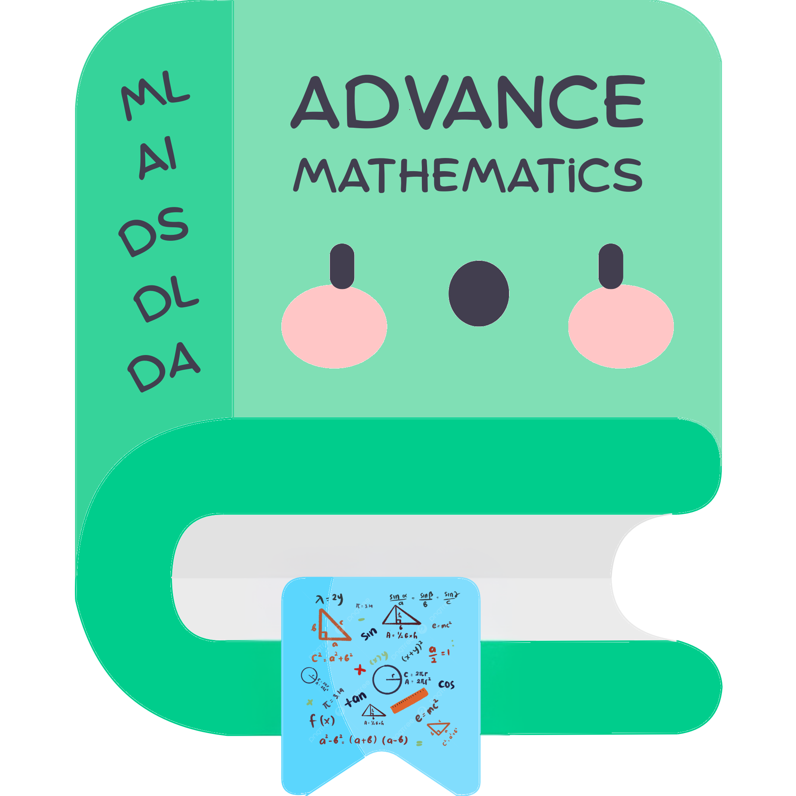
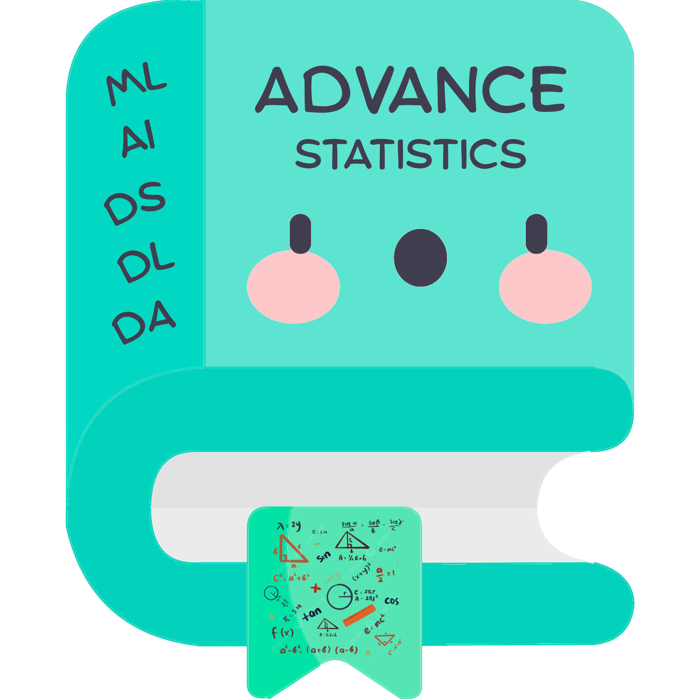

<table>
    <tr>
        <td align="center">
            
        </td>
        <td align="center">
            
        </td>
    </tr>
</table>

# Mathematics and Advanced Statistics


This repository contains a collection of mathematical concepts and advanced statistical methods, along with their implementations in Python and MySQL. It serves as a resource for students, researchers, and professionals looking to deepen their understanding of these topics.
It is intended for learning, experimentation, and demonstration of mathematical and statistical concepts.

## Contents

- **Mathematics**: This section includes various mathematical concepts, formulas, and algorithms implemented in Python. Topics covered include algebra, calculus, geometry, and more.
- **Advanced Statistics**: This section focuses on advanced statistical methods and techniques, with implementations in both Python and MySQL. Topics include hypothesis testing, regression analysis, Bayesian statistics, and more.
- **Examples and Use Cases**: Each section contains practical examples and use cases to illustrate the application of the concepts discussed.

## Getting Started

1. Clone the repository:
   ```bash
   git clone https://github.com/Prath-Digital/Mathematics_and_Advanced_Statistics.git
   ```
2. Navigate to the project folder:
   ```bash
    cd Mathematics_and_Advanced_Statistics
   ```
3. Run the Interactive Python Notebooks using Jupyter Notebook or Jupyter Lab:
   ```bash
   jupyter notebook
   ```

## Requirements

- Python 3.10(recommended) or higher

## License

This project is licensed under the MIT License. See the [LICENSE](LICENSE) file for details.

<h1>Mathematics and Advanced Statistics Progress</h1>
<table style="width:100%;border-collapse:collapse;font-family:'cascadia code','Segoe UI',Arial,sans-serif;">
  <thead>
    <tr style="background:#000;color:#fff;">
      <th style="padding:10px 8px;border:2px solid #fff;background:#000;">No.</th>
      <th style="padding:10px 8px;border:2px solid #fff;background:#000;">Topics</th>
    </tr>
  </thead>
  <tbody>
    <tr style="background:#222;color:#fff;">
      <td style="padding:10px 8px;border:2px solid #fff;">1</td>
      <td style="padding:10px 8px;border:2px solid #fff;"><b>Descriptive Statistics</b></td>
    </tr>
    <tr style="background:#fff; color:#000;">
      <td style="padding:10px 8px;border:2px solid #000;">1.1</td>
      <td style="padding:10px 8px;border:2px solid #000;">
        <ul style="margin:0;padding-left:18px;">
          <li><span style="color:#d32f2f;">What is Statistics and Their use cases in data science?</span></li>
          <li><span style="color:#1976d2;">What is Data in Statistics & Applications of Statistics?</span></li>
          <li><span style="color:#388e3c;">Types of Data - Numerical And Categorical data</span></li>
          <li><span style="color:#fbc02d;">Representation of Data - Different Graphs and patterns</span></li>
          <li><span style="color:#7b1fa2;">Population vs Sample</span></li>
        </ul>
        <span style="color:#fff;background:#7b1fa2;padding:2px 6px;border-radius:4px;"><a style="color:#fff;text-decoration:none;" href="./Work/Lab Work/ch_1/lec_1.1/">Lab Work</a></span>
        <span style="color:#fff;background:#43a047;padding:2px 6px;border-radius:4px;margin-left:8px;"><a style="color:#fff;text-decoration:none;" href="./Work/Self Excercise/ch_1/lec_1.1/">Self Exercises</a></span>
      </td>
    </tr>
    <tr style="background:#222;color:#fff;">
      <td style="padding:10px 8px;border:2px solid #fff;">1.2</td>
      <td style="padding:10px 8px;border:2px solid #fff;">
        <ul style="margin:0;padding-left:18px;">
          <li><span style="color:#d32f2f;">Types of Statistics</span></li>
          <li><span style="color:#1976d2;">What Is Descriptive Statistics?</span></li>
          <li><span style="color:#388e3c;">Measures of Central Tendency - Mean, Median, Mode</span></li>
          <li><span style="color:#fbc02d;">Measures of Dispersion - Range, Variance, Standard Deviation</span></li>
        </ul>
        <span style="color:#fff;background:#7b1fa2;padding:2px 6px;border-radius:4px;"><a style="color:#fff;text-decoration:none;" href="./Work/Lab Work/ch_1/lec_1.2/">Lab Work</a></span>
        <span style="color:#fff;background:#43a047;padding:2px 6px;border-radius:4px;margin-left:8px;"><a style="color:#fff;text-decoration:none;" href="./Work/Self Excercise/ch_1/lec_1.2/">Self Exercises</a></span>
      </td>
    </tr>
    <tr style="background:#fff; color:#000;">
      <td style="padding:10px 8px;border:2px solid #000;">1.3</td>
      <td style="padding:10px 8px;border:2px solid #000;">
        <ul style="margin:0;padding-left:18px;">
          <li><span style="color:#d32f2f;">Gaussian Normal Distribution</span></li>
          <li><span style="color:#1976d2;">Skewness and Kurtosis</span></li>
        </ul>
        <span style="color:#fff;background:#7b1fa2;padding:2px 6px;border-radius:4px;"><a style="color:#fff;text-decoration:none;" href="./Work/Lab Work/ch_1/lec_1.3/">Lab Work</a></span>
        <span style="color:#fff;background:#43a047;padding:2px 6px;border-radius:4px;margin-left:8px;"><a style="color:#fff;text-decoration:none;" href="./Work/Self Excercise/ch_1/lec_1.3/">Self Exercises</a></span>
      </td>
    </tr>
    <tr><td colspan="2" style="background:#000;"><hr style="border:1px solid #fff; background:transparent;"></td></tr>
    <tr style="background:#222;color:#fff;">
      <td style="padding:10px 8px;border:2px solid #fff;">2</td>
      <td style="padding:10px 8px;border:2px solid #fff;"><b>PR. 1 Descriptive Booster</b></td>
    </tr>
    <tr style="background:#fff; color:#000;">
      <td style="padding:10px 8px;border:2px solid #000;">2.1</td>
      <td style="padding:10px 8px;border:2px solid #000;">
        <ul style="margin:0;padding-left:18px;">
          <li><span style="color:#d32f2f;">PR. 1 Descriptive Booster</span></li>
        </ul>
        <span style="color:#fff;background:#7b1fa2;padding:2px 6px;border-radius:4px;"><a style="color:#fff;text-decoration:none;" href="https://github.com/Prath-Digital/Mathematics_and_Advanced_Statistics-PR.-1-Descriptive-Booster" target="_blank">Code</a></span>
      </td>
    </tr>
    <tr><td colspan="2" style="background:#000;"><hr style="border:1px solid #fff;"></td></tr>
    <tr style="background:#222;color:#fff;">
      <td style="padding:10px 8px;border:2px solid #fff;">3</td>
      <td style="padding:10px 8px;border:2px solid #fff;"><b>Probability</b></td>
    </tr>
    <tr style="background:#fff; color:#000;">
      <td style="padding:10px 8px;border:2px solid #000;">3.1</td>
      <td style="padding:10px 8px;border:2px solid #000;">
        <ul style="margin:0;padding-left:18px;">
          <li><span style="color:#d32f2f;">What is Probability</span></li>
          <li><span style="color:#1976d2;">Probability Terminology</span></li>
          <li><span style="color:#388e3c;">Probability Event Examples</span></li>
          <li><span style="color:#fbc02d;">Types of Events Empirical<br>Probability Vs Theoretical Probability</span></li>
        </ul>
        <span style="color:#fff;background:#7b1fa2;padding:2px 6px;border-radius:4px;"><a style="color:#fff;text-decoration:none;" href="./Work/Lab Work/ch_2/lec_2.1/">Lab Work</a></span>
        <span style="color:#fff;background:#43a047;padding:2px 6px;border-radius:4px;margin-left:8px;"><a style="color:#fff;text-decoration:none;" href="./Work/Self Excercise/ch_2/lec_2.1/">Self Exercises</a></span>
      </td>
    </tr>
    <tr style="background:#222;color:#fff;">
      <td style="padding:10px 8px;border:2px solid #fff;">3.2</td>
      <td style="padding:10px 8px;border:2px solid #fff;">
        <ul style="margin:0;padding-left:18px;">
          <li><span style="color:#d32f2f;">Random Variable</span></li>
          <li><span style="color:#1976d2;">Probability Distribution</span></li>
          <li><span style="color:#388e3c;">Mean of a Random Variable</span></li>
          <li><span style="color:#fbc02d;">Variance of a Random Variable</span></li>
        </ul>
        <span style="color:#fff;background:#7b1fa2;padding:2px 6px;border-radius:4px;"><a style="color:#fff;text-decoration:none;" href="./Work/Lab Work/ch_2/lec_2.2/">Lab Work</a></span>
        <span style="color:#fff;background:#43a047;padding:2px 6px;border-radius:4px;margin-left:8px;"><a style="color:#fff;text-decoration:none;" href="./Work/Self Excercise/ch_2/lec_2.2/">Self Exercises</a></span>
      </td>
    </tr>
    <tr style="background:#fff; color:#000;">
      <td style="padding:10px 8px;border:2px solid #000;">3.3</td>
      <td style="padding:10px 8px;border:2px solid #000;">
        <ul style="margin:0;padding-left:18px;">
          <li><span style="color:#1976d2;">Venn Diagrams in Probability</span></li>
          <li><span style="color:#388e3c;">Contingency tables in Probability</span></li>
          <li><span style="color:#fbc02d;">Joint Probability</span></li>
          <li><span style="color:#7b1fa2;">Marginal Probability</span></li>
        </ul>
        <span style="color:#fff;background:#7b1fa2;padding:2px 6px;border-radius:4px;"><a style="color:#fff;text-decoration:none;" href="./Work/Lab Work/ch_2/lec_2.3/">Lab Work</a></span>
        <span style="color:#fff;background:#43a047;padding:2px 6px;border-radius:4px;margin-left:8px;"><a style="color:#fff;text-decoration:none;" href="./Work/Self Excercise/ch_2/lec_2.3/">Self Exercises</a></span>
      </td>
    </tr>
    <tr style="background:#222;color:#fff;">
      <td style="padding:10px 8px;border:2px solid #fff;">3.4</td>
      <td style="padding:10px 8px;border:2px solid #fff;">
        <ul style="margin:0;padding-left:18px;">
          <li><span style="color:#d32f2f;">Conditional Probability</span></li>
          <li><span style="color:#1976d2;">Intuition of Conditional Probability Formula</span></li>
          <li><span style="color:#388e3c;">Independent vs. Dependent vs. Mutually Exclusive Events</span></li>
          <li><span style="color:#fbc02d;">Bayes Theorem</span></li>
        </ul>
        <span style="color:#fff;background:#7b1fa2;padding:2px 6px;border-radius:4px;"><a style="color:#fff;text-decoration:none;" href="./Work/Lab Work/ch_2/lec_2.4/">Lab Work</a></span>
        <span style="color:#fff;background:#43a047;padding:2px 6px;border-radius:4px;margin-left:8px;"><a style="color:#fff;text-decoration:none;" href="./Work/Self Excercise/ch_2/lec_2.4/">Self Exercises</a></span>
      </td>
    </tr>
    <tr><td colspan="2" style="background:#000;"><hr style="border:1px solid #fff;"></td></tr>
    <tr style="background:#222;color:#fff;">
      <td style="padding:10px 8px;border:2px solid #fff;">4</td>
      <td style="padding:10px 8px;border:2px solid #fff;"><b>PR. 2 Expectation Decider
</b></td>
    </tr>
    <tr style="background:#fff; color:#000;">
      <td style="padding:10px 8px;border:2px solid #000;">4.1</td>
      <td style="padding:10px 8px;border:2px solid #000;">
        <ul style="margin:0;padding-left:18px;">
          <li><span style="color:#d32f2f;">PR. 2 Expectation Decider
</span></li>
        </ul>
        <span style="color:#fff;background:#7b1fa2;padding:2px 6px;border-radius:4px;"><a style="color:#fff;text-decoration:none;" href="https://github.com/Prath-Digital/Mathematics_and_Advanced_Statistics-PR.-2-Expectation-Decider"
" target="_blank">Code</a></span>
      </td>
    </tr>
    <tr><td colspan="2" style="background:#000;"><hr style="border:1px solid #fff;"></td></tr>
    <tr style="background:#222;color:#fff;">
      <td style="padding:10px 8px;border:2px solid #fff;">5</td>
      <td style="padding:10px 8px;border:2px solid #fff;"><b>Inferential Statistics</b></td>
    </tr>
    <tr style="background:#fff; color:#000;">
      <td style="padding:10px 8px;border:2px solid #000;">5.1</td>
      <td style="padding:10px 8px;border:2px solid #000;">
        <ul style="margin:0;padding-left:18px;">
          <li><span style="color:#d32f2f;">Inferential Statistics - Types of Statistics</span></li>
          <li><span style="color:#1976d2;">What Is Inferential Statistics?</span></li>
          <li><span style="color:#388e3c;">What Is Hypothesis Testing?</span></li>
          <li><span style="color:#fbc02d;">Null Hypotheses And Alternate Hypotheses</span></li>
        </ul>
        <span style="color:#fff;background:#7b1fa2;padding:2px 6px;border-radius:4px;"><a style="color:#fff;text-decoration:none;" href="./Work/Lab Work/ch_3/lec_3.1/">Lab Work</a></span>
        <span style="color:#fff;background:#43a047;padding:2px 6px;border-radius:4px;margin-left:8px;"><a style="color:#fff;text-decoration:none;" href="./Work/Self Excercise/ch_3/lec_3.1/">Self Exercises</a></span>
      </td>
    </tr>
    <tr style="background:#222;color:#fff;">
      <td style="padding:10px 8px;border:2px solid #fff;">5.2</td>
      <td style="padding:10px 8px;border:2px solid #fff;">
        <ul style="margin:0;padding-left:18px;">
          <li><span style="color:#d32f2f;">What Is P Value And confidence Interval, Critical Value</span></li>
          <li><span style="color:#1976d2;">Hypothesis Testing - Type I and Type II errors</span></li>
        </ul>
        <span style="color:#fff;background:#7b1fa2;padding:2px 6px;border-radius:4px;"><a style="color:#fff;text-decoration:none;" href="./Work/Lab Work/ch_3/lec_3.2/">Lab Work</a></span>
        <span style="color:#fff;background:#43a047;padding:2px 6px;border-radius:4px;margin-left:8px;"><a style="color:#fff;text-decoration:none;" href="./Work/Self Excercise/ch_3/lec_3.2/">Self Exercises</a></span>
      </td>
    </tr>
    <tr style="background:#fff; color:#000;">
      <td style="padding:10px 8px;border:2px solid #000;">5.3</td>
      <td style="padding:10px 8px;border:2px solid #000;">
        <ul style="margin:0;padding-left:18px;">
          <li><span style="color:#d32f2f;">Z-Test (One-sample & Two-sample)</span></li>
        </ul>
        <span style="color:#fff;background:#7b1fa2;padding:2px 6px;border-radius:4px;"><a style="color:#fff;text-decoration:none;" href="./Work/Lab Work/ch_3/lec_3.3/">Lab Work</a></span>
        <span style="color:#fff;background:#43a047;padding:2px 6px;border-radius:4px;margin-left:8px;"><a style="color:#fff;text-decoration:none;" href="./Work/Self Excercise/ch_3/lec_3.3/">Self Exercises</a></span>
      </td>
    </tr>
    <tr style="background:#222;color:#fff;">
      <td style="padding:10px 8px;border:2px solid #fff;">5.4</td>
      <td style="padding:10px 8px;border:2px solid #fff;">
        <ul style="margin:0;padding-left:18px;">
          <li><span style="color:#d32f2f;">T-Test (One-sample & Two-sample)
</span></li>
        </ul>
        <span style="color:#fff;background:#7b1fa2;padding:2px 6px;border-radius:4px;"><a style="color:#fff;text-decoration:none;" href="./Work/Lab Work/ch_3/lec_3.4/">Lab Work</a></span>
        <span style="color:#fff;background:#43a047;padding:2px 6px;border-radius:4px;margin-left:8px;"><a style="color:#fff;text-decoration:none;" href="./Work/Self Excercise/ch_3/lec_3.4/">Self Exercises</a></span>
      </td>
    </tr>
    <tr style="background:#fff; color:#000;">
      <td style="padding:10px 8px;border:2px solid #000;">5.5</td>
      <td style="padding:10px 8px;border:2px solid #000;">
        <ul style="margin:0;padding-left:18px;">
          <li><span style="color:#d32f2f;">Central Limit Theorem</span></li>
          <li><span style="color:#1976d2;">Chi-Square Test</span></li>
          <li><span style="color:#388e3c;">Test Implementation of categorical data
</span></li>
        </ul>
        <span style="color:#fff;background:#7b1fa2;padding:2px 6px;border-radius:4px;"><a style="color:#fff;text-decoration:none;" href="./Work/Lab Work/ch_3/lec_3.5/">Lab Work</a></span>
        <span style="color:#fff;background:#43a047;padding:2px 6px;border-radius:4px;margin-left:8px;"><a style="color:#fff;text-decoration:none;" href="./Work/Self Excercise/ch_3/lec_3.5/">Self Exercises</a></span>
      </td>
    </tr>
    <tr style="background:#222;color:#fff;">
      <td style="padding:10px 8px;border:2px solid #fff;">5.6</td>
      <td style="padding:10px 8px;border:2px solid #fff;">
        <ul style="margin:0;padding-left:18px;">
          <li><span style="color:#d32f2f;">ANOVA Test</span></li>
          <li><span style="color:#1976d2;">Test Implementation of continuous data</span></li>
        </ul>
        <span style="color:#fff;background:#7b1fa2;padding:2px 6px;border-radius:4px;"><a style="color:#fff;text-decoration:none;" href="./Work/Lab Work/ch_3/lec_3.6/">Lab Work</a></span>
        <span style="color:#fff;background:#43a047;padding:2px 6px;border-radius:4px;margin-left:8px;"><a style="color:#fff;text-decoration:none;" href="./Work/Self Excercise/ch_3/lec_3.6/">Self Exercises</a></span>
      </td>
    </tr>
    <tr style="background:#fff; color:#000;">
      <td style="padding:10px 8px;border:2px solid #000;">5.7</td>
      <td style="padding:10px 8px;border:2px solid #000;">
        <ul style="margin:0;padding-left:18px;">
          <li><span style="color:#d32f2f;">Relationship between variables</span></li>
          <li><span style="color:#1976d2;">Covariance and correlation</span></li>
          <li><span style="color:#388e3c;">Pearson correlation coefficient and Spearman correlation</span></li>
        </ul>
        <span style="color:#fff;background:#7b1fa2;padding:2px 6px;border-radius:4px;"><a style="color:#fff;text-decoration:none;" href="./Work/Lab Work/ch_3/lec_3.7/">Lab Work</a></span>
        <span style="color:#fff;background:#43a047;padding:2px 6px;border-radius:4px;margin-left:8px;"><a style="color:#fff;text-decoration:none;" href="./Work/Self Excercise/ch_3/lec_3.7/">Self Exercises</a></span>
      </td>
    </tr>
    <tr style="background:#222;color:#fff"><td colspan="2" style="background:#000;"><hr style="border:1px solid #fff;"></td></tr>
    <tr style="background:#222;color:#fff;">
      <td style="padding:10px 8px;border:2px solid #fff;">6</td>
      <td style="padding:10px 8px;border:2px solid #fff;"><b>PR. 3 Derivable Judgement</b></td>
    </tr>
    <tr style="background:#fff;color:#000;">
      <td style="padding:10px 8px;border:2px solid #000;">6.1</td>
      <td style="padding:10px 8px;border:2px solid #000;">
        <span style="color:#d32f2f;">PR. 3 Derivable Judgement</span><br>
        <span style="color:#fff;background:#7b1fa2;padding:2px 6px;border-radius:4px;display:inline-block;margin-top:8px;"><a style="color:#fff;text-decoration:none;" href="https://github.com/Prath-Digital/Mathematics_and_Advanced_Statistics-PR.-3-Derivable-Judgement" target="_blank">Code</a></span>
      </td>
    </tr>
    <tr style="background:#222;color:#fff;"><td colspan="2" style="background:#000;"><hr style="border:1px solid #fff;"></td></tr>
    <tr style="background:#222;color:#fff;">
      <td style="padding:10px 8px;border:2px solid #fff;">7</td>
      <td style="padding:10px 8px;border:2px solid #fff;"><b>Advanced Statistics</b></td>
    </tr>
    <tr style="background:#fff;color:#000;">
      <td style="padding:10px 8px;border:2px solid #000;">7.1</td>
      <td style="padding:10px 8px;border:2px solid #000;">
        <ul style="margin:0;padding-left:18px;">
          <li><span style="color:#d32f2f;">What is Statistical Distributions</span></li>
          <li><span style="color:#1976d2;">Q-Q Plot</span></li>
          <li><span style="color:#388e3c;">Discrete and Continuous Distribution</span></li>
          <li><span style="color:#fbc02d;">Bernouli and Binomial distribution</span></li>
        </ul>
        <span style="color:#fff;background:#7b1fa2;padding:2px 6px;border-radius:4px;"><a style="color:#fff;text-decoration:none;" href="./Work/Lab Work/ch_4/lec_4.1/">Lab Work</a></span>
        <span style="color:#fff;background:#43a047;padding:2px 6px;border-radius:4px;margin-left:8px;"><a style="color:#fff;text-decoration:none;" href="./Work/Self Excercise/ch_4/lec_4.1/">Self Exercises</a></span>
      </td>
    </tr>
    <tr style="background:#222;color:#fff;">
      <td style="padding:10px 8px;border:2px solid #fff;">7.2</td>
      <td style="padding:10px 8px;border:2px solid #fff;">
        <ul style="margin:0;padding-left:18px;">
          <li><span style="color:#d32f2f;">Log Normal distribution</span></li>
          <li><span style="color:#1976d2;">Power Law distribution</span></li>
          <li><span style="color:#388e3c;">Box cox transform</span></li>
        </ul>
        <span style="color:#fff;background:#7b1fa2;padding:2px 6px;border-radius:4px;"><a style="color:#fff;text-decoration:none;" href="./Work/Lab Work/ch_4/lec_4.2/">Lab Work</a></span>
        <span style="color:#fff;background:#43a047;padding:2px 6px;border-radius:4px;margin-left:8px;"><a style="color:#fff;text-decoration:none;" href="./Work/Self Excercise/ch_4/lec_4.2/">Self Exercises</a></span>
      </td>
    </tr>
    <tr style="background:#fff;color:#000;">
      <td style="padding:10px 8px;border:2px solid #000;">7.3</td>
      <td style="padding:10px 8px;border:2px solid #000;">
        <ul style="margin:0;padding-left:18px;">
          <li><span style="color:#d32f2f;">Poisson distribution</span></li>
          <li><span style="color:#1976d2;">Z-score Probability</span></li>
          <li><span style="color:#388e3c;">Density function & Cumulative distribution function</span></li>
        </ul>
        <span style="color:#fff;background:#7b1fa2;padding:2px 6px;border-radius:4px;"><a style="color:#fff;text-decoration:none;" href="./Work/Lab Work/ch_4/lec_4.3/">Lab Work</a></span>
        <span style="color:#fff;background:#43a047;padding:2px 6px;border-radius:4px;margin-left:8px;"><a style="color:#fff;text-decoration:none;" href="./Work/Self Excercise/ch_4/lec_4.3/">Self Exercises</a></span>
      </td>
    </tr>
    <tr><td colspan="2" style="background:#000;"><hr style="border:1px solid #fff;"></td></tr>
    <tr style="background:#222;color:#fff;">
      <td style="padding:10px 8px;border:2px solid #fff;">8</td>
      <td style="padding:10px 8px;border:2px solid #fff;"><b>PR. 4 Spread Locator</b></td>
    </tr>
    <tr style="background:#fff;color:#000;">
      <td style="padding:10px 8px;border:2px solid #000;">8.1</td>
      <td style="padding:10px 8px;border:2px solid #000;">
        <ul style="margin:0;padding-left:18px;">
          <li><span style="color:#d32f2f;">PR. 4 Spread Locator</span></li>
        </ul>
        <span style="color:#fff;background:#7b1fa2;padding:2px 6px;border-radius:4px;"><a style="color:#fff;text-decoration:none;" href="https://github.com/Prath-Digital/Mathematics_and_Advanced_Statistics-PR.-4-Spread-Locator" target="_blank">Code</a></span>
      </td>
    </tr>
    <tr><td colspan="2" style="background:#000;"><hr style="border:1px solid #fff;"></td></tr>
    <tr style="background:#222;color:#fff;">
      <td style="padding:10px 8px;border:2px solid #fff;">9</td>
      <td style="padding:10px 8px;border:2px solid #fff;"><b>Assignment</b></td>
    </tr>
    <tr style="background:#fff;color:#000;">
      <td style="padding:10px 8px;border:2px solid #000;">9.1</td>
      <td style="padding:10px 8px;border:2px solid #000;">
        <ul style="margin:0;padding-left:18px;">
          <li><span style="color:#d32f2f;">📖 Assignment</span></li>
        </ul>
      </td>
    </tr>
    <tr><td colspan="2" style="background:#000;"><hr style="border:1px solid #fff;"></td></tr>
    <tr style="background:#222;color:#fff;">
      <td style="padding:10px 8px;border:2px solid #fff;">10</td>
      <td style="padding:10px 8px;border:2px solid #fff;"><b>Linear Algebra</b></td>
    </tr>
    <tr style="background:#fff;color:#000;">
      <td style="padding:10px 8px;border:2px solid #000;">10.1</td>
      <td style="padding:10px 8px;border:2px solid #000;">
        <ul style="margin:0;padding-left:18px;">
          <li><span style="color:#d32f2f;">What is Linear Algebra</span></li>
          <li><span style="color:#1976d2;">Vector vs Point</span></li>
          <li><span style="color:#388e3c;">Vector and its operations</span></li>
        </ul>
        <span style="color:#fff;background:#7b1fa2;padding:2px 6px;border-radius:4px;"><a style="color:#fff;text-decoration:none;" href="./Work/Lab Work/ch_5/lec_5.1/">Lab Work</a></span>
        <span style="color:#fff;background:#43a047;padding:2px 6px;border-radius:4px;margin-left:8px;"><a style="color:#fff;text-decoration:none;" href="./Work/Self Excercise/ch_5/lec_5.1/">Self Exercises</a></span>
      </td>
    </tr>
    <tr style="background:#222;color:#fff;">
      <td style="padding:10px 8px;border:2px solid #fff;">10.2</td>
      <td style="padding:10px 8px;border:2px solid #fff;">
        <ul style="margin:0;padding-left:18px;">
          <li><span style="color:#d32f2f;">Vector / Point distance</span></li>
          <li><span style="color:#1976d2;">Norm 1 and Norm 2 Formula
Unit Vector</span></li>
          <li><span style="color:#388e3c;">Unit Vector</span></li>
          <li><span style="color:#fbc02d;">Dot Product vs Cross Product</span></li>
        </ul>
        <span style="color:#fff;background:#7b1fa2;padding:2px 6px;border-radius:4px;"><a style="color:#fff;text-decoration:none;" href="./Work/Lab Work/ch_5/lec_5.2/">Lab Work</a></span>
        <span style="color:#fff;background:#43a047;padding:2px 6px;border-radius:4px;margin-left:8px;"><a style="color:#fff;text-decoration:none;" href="./Work/Self Excercise/ch_5/lec_5.2/">Self Exercises</a></span>
      </td>
    </tr>
    <tr style="background:#fff;color:#000;">
      <td style="padding:10px 8px;border:2px solid #000;">10.3</td>
      <td style="padding:10px 8px;border:2px solid #000;">
        <ul style="margin:0;padding-left:18px;">
          <li><span style="color:#d32f2f;">Angle between two Vector</span></li>
          <li><span style="color:#1976d2;">Vector Projection</span></li>
          <li><span style="color:#388e3c;">Line vs plane vs hyperplane</span></li>
          <li><span style="color:#fbc02d;">Matrix, Matrix types, Matrix operations</span></li>
        </ul>
        <span style="color:#fff;background:#7b1fa2;padding:2px 6px;border-radius:4px;"><a style="color:#fff;text-decoration:none;" href="./Work/Lab Work/ch_5/lec_5.3/">Lab Work</a></span>
        <span style="color:#fff;background:#43a047;padding:2px 6px;border-radius:4px;margin-left:8px;"><a style="color:#fff;text-decoration:none;" href="./Work/Self Excercise/ch_5/lec_5.3/">Self Exercises</a></span>
      </td>
    </tr>
    <tr style="background:#222;color:#fff;">
      <td style="padding:10px 8px;border:2px solid #fff;">10.4</td>
      <td style="padding:10px 8px;border:2px solid #fff;">
        <ul style="margin:0;padding-left:18px;">
          <li><span style="color:#d32f2f;">Eigenvalue and Eigenvector</span></li>
          <li><span style="color:#1976d2;">Factorization/Decomposition</span></li>
        </ul>
        <span style="color:#fff;background:#7b1fa2;padding:2px 6px;border-radius:4px;"><a style="color:#fff;text-decoration:none;" href="./Work/Lab Work/ch_5/lec_5.4/">Lab Work</a></span>
        <span style="color:#fff;background:#43a047;padding:2px 6px;border-radius:4px;margin-left:8px;"><a style="color:#fff;text-decoration:none;" href="./Work/Self Excercise/ch_5/lec_5.4/">Self Exercises</a></span>
      </td>
    </tr>
    <tr style="background:#fff;color:#000;">
      <td style="padding:10px 8px;border:2px solid #000;">10.5</td>
      <td style="padding:10px 8px;border:2px solid #000;">
        <ul style="margin:0;padding-left:18px;">
          <li><span style="color:#d32f2f;">Eigen Decomposition - SVD, PCA, LDA</span></li>
        </ul>
        <span style="color:#fff;background:#7b1fa2;padding:2px 6px;border-radius:4px;"><a style="color:#fff;text-decoration:none;" href="./Work/Lab Work/ch_5/lec_5.5/">Lab Work</a></span>
        <span style="color:#fff;background:#43a047;padding:2px 6px;border-radius:4px;margin-left:8px;"><a style="color:#fff;text-decoration:none;" href="./Work/Self Excercise/ch_5/lec_5.5 /">Self Exercises</a></span>
      </td>
    </tr>
    <tr><td colspan="2" style="background:#000;"><hr style="border:1px solid #fff;"></td></tr>
    <tr style="background:#222;color:#fff;">
      <td style="padding:10px 8px;border:2px solid #fff;">11</td>
      <td style="padding:10px 8px;border:2px solid #fff;"><b>PR. 5 Calculative Foundation
</b></td>
    </tr>
    <tr style="background:#fff;color:#000;">
      <td style="padding:10px 8px;border:2px solid #000;">11.1</td>
      <td style="padding:10px 8px;border:2px solid #000;">
        <ul style="margin:0;padding-left:18px;">
          <li><span style="color:#d32f2f;">PR. 5 Calculative Foundation
</span></li>
        </ul>
        <span style="color:#fff;background:#7b1fa2;padding:2px 6px;border-radius:4px;"><a style="color:#fff;text-decoration:none;" href="https://github.com/Prath-Digital/Mathematics_and_Advanced_Statistics-PR.-5-Calculative-Foundation" target="_blank">Code</a></span>
      </td>
    </tr>
    <tr><td colspan="2" style="background:#000;"><hr style="border:1px solid #fff;"></td></tr>
    <tr style="background:#222;color:#fff;">
      <td style="padding:10px 8px;border:2px solid #fff;">12</td>
      <td style="padding:10px 8px;border:2px solid #fff;"><b>Practical Exam</b></td>
    </tr>
    <tr style="background:#fff;color:#000;">
      <td style="padding:10px 8px;border:2px solid #000;">12.1</td>
      <td style="padding:10px 8px;border:2px solid #000;">
        <ul style="margin:0;padding-left:18px;">
          <li><span style="color:#d32f2f;">Practical Exam</span></li>
        </ul>
        <span style="color:#fff;background:#7b1fa2;padding:2px 6px;border-radius:4px;"><a style="color:#fff;text-decoration:none;" href="https://github.com/Prath-Digital/Mathematics_and_Advanced_Statistics-Practical-Exam" target="_blank">Code</a></span>
      </td>
    </tr>
  </tbody>
  </table>
<hr style="background:transparent;">
<blockquote>
  <b>📝 Note:</b><br>This table tracks your Mathematics and Advanced Statistics learning progress, including lab work and self exercises for each topic.
</blockquote>
<br>
<blockquote><b>💡 Tip:</b><br>Explore Mathematics and Advanced Statistics documentation and community forums to deepen your understanding and solve coding challenges efficiently.</blockquote>
